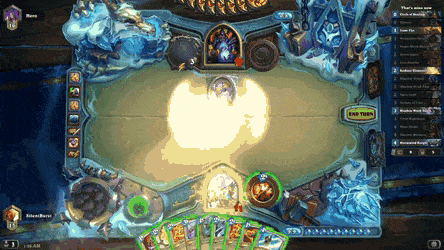

# Research-Input_Combos

I am <a href="https://www.linkedin.com/in/gerard-marcos-freixas-0a9284158">Gerard Marcos</a>, student of the
<a href="https://www.citm.upc.edu/ing/estudis/graus-videojocs">Bachelor’s Degree in
Video Games by UPC at CITM</a>. This content is generated for the second year’s
subject Project 2, under supervision of lecturer
<a href="https://es.linkedin.com/in/ricardpillosu">Ricard Pillosu</a>.

## About

**Repository:** Click [here](https://github.com/vsRushy/Research-Input_Combos)

**Webpage:** Click [here](https://vsrushy.github.io/Research-Input_Combos/)

**Presentation:** Click [here](https://docs.google.com/presentation/d/16z97q2Py7VZDIpAKD4kI0Hrswirgs1L-MljOpgHzotc/edit?usp=sharing)

## Index

* Introduction
  * Presentation blocks
  * What is a combo?
* Block I: Deeping into the subject
  * Combo differentiation
    * Time dependency
    * Immediate and holding input
    * Degree of freedom
    * Definition & input scheme
* Block II: Code structure
  * Input storage
  * Memory management
  * The implementation in-depth
* Code exercises
* Extra concepts

## Content

### 1. Introduction

This project main objective is to learn how to implement an input combo system using C++, the SDL library and pugixml library.

#### 1.1. Presentation blocks

The project is divided by two main sections. On the one hand, the first one includes several essential theorical concepts. This way, we have many options to choose from so we can implement it in our projects. On the other hand, the second one includes the code structure of the implementation, with its explanations of the practical concepts.

Note that there are coding exercises in order to understand the system a lot better and learn it quickly and effectively.

#### 1.2. What is a combo?

Wikipedia's definition of combo is: set of actions performed in sequence, usually with strict timing limitations, that yield a significant benefit or advantage.

This definition is incorrect, in the "usually with strict timing limitations". We'll get into the correct definition soon.

### 2. Deeping into the subject

Let's learn new concepts related to a combo.

#### 2.1. Combo differentiation

Between the two images above, we can say that there is the **first main factor** that differentiates different combo types: **the time**.

In the first image, the timing is not important at all. And in the second image, the combo is determined by the timing of the user.

##### 2.1.1. Time dependency

We can divide a comby by two types:

* **Time-independent:** Only composed by single inputs, meaning only one button is pressed after the previous one.
  * **Single input**

* **Time-dependent:** Composed by single inputs, parallel inputs, meaning multiple buttons can be pressed at the same time, and a mix of the two.
  * **Single input**
  * **Parallel input**
  * **Single & parallel input**

##### 2.1.2. Immediate and holding input

It is also necessary to differentiate if an input is immediate or holded. Consequently, if the input is immediate, the videogame will have  more frenetic, frenzy and active gameplay; the opposite happens when the input is holded.

Therefore, the **second main factor** that determines a combo is **the time pressing a button**.

A very clear example of the immediate input is the videogame Street Figther II, and another clear example of the holding input is the videogame Heavy Rain.

##### 2.1.3. Degree of freedom

The **third main factor** that determines a combo is its **degree of freedom**. This means that the chain of input events of a combo can be checked (or not). For a better understanding of this, a good example is the videogame Hearthstone. The combos aren't determined by the developers, but the input events still create a combo. For instance, the combos can be determined by the development team, like Tekken 7, for instance, in which the combo chain needs to be like the predefined combo chain in order to execute the combo. Therefore:

* **Input degrees of freedom**
  * **Defined:** Determined chains, checked chains.
  * **Undefined** Undetermined chains, unchecked chains.

##### 2.1.4. Definition & input scheme

That being said, the final and correct definition for combo is:

**Combo:** Set of actions performed in sequence, with or without strict timing limitations, that yield a significant benefit or advantage.

Here there is also a scheme focusing on the aspects stated above.

It must be clear what the objectives of the videogame are, and select the input combo types from the scheme, depending on the gameplay and user experience.

### 3. Code structure

Now let's get into the code and practical part, where an input combo system is implemented.

#### 3.1. Input storage

We need to save every input event whenever the user presses a key or button. Hence, we follow the user inputs by **input tracking**.

In a list, we store the user inputs. It works as a buffer. It has no limit, but it could be a potential future implementation. But remember that we also need to store the predefined combos and its input events! The combos and its input events that form a combo are stored in a vector.

The development team need to define the combos in a .xml file, following an existing structure.

The key here is to check if the array of the input events that are stored in every combo exists in the same order in the buffer.

For instance:

#### 3.2. Memory management

There is no way we can't store all these input events in the buffer forever. Therefore, we need to create some rules in order to decide when to delete these input events. Note that the input events are dynamically allocated in memory. 

#### 3.3. The implementation in-depth

### 4. Code exercises

### 5. Extra concepts

## Credits

**Author:** Gerard Marcos Freixas

## Useful links and references

[Link 1](https://en.wikipedia.org/wiki/Combo_(video_gaming))

[Link 2](https://www.giantbomb.com/combo/3015-18/)

[Link 3](https://thirdpersonblog.wordpress.com/2011/08/18/universal-fighting-game-guide-understanding-combo-systems-part-1-the-elements/)

[Link 4](https://www.reddit.com/r/gamedev/comments/1yu4px/how_to_properly_handle_tons_of_inputs_in_a/)
